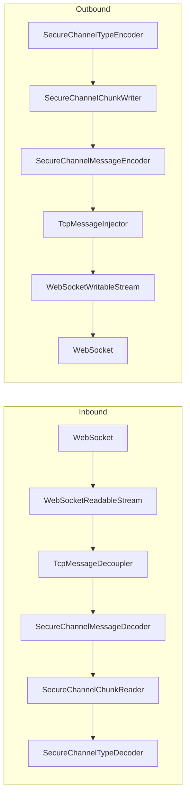
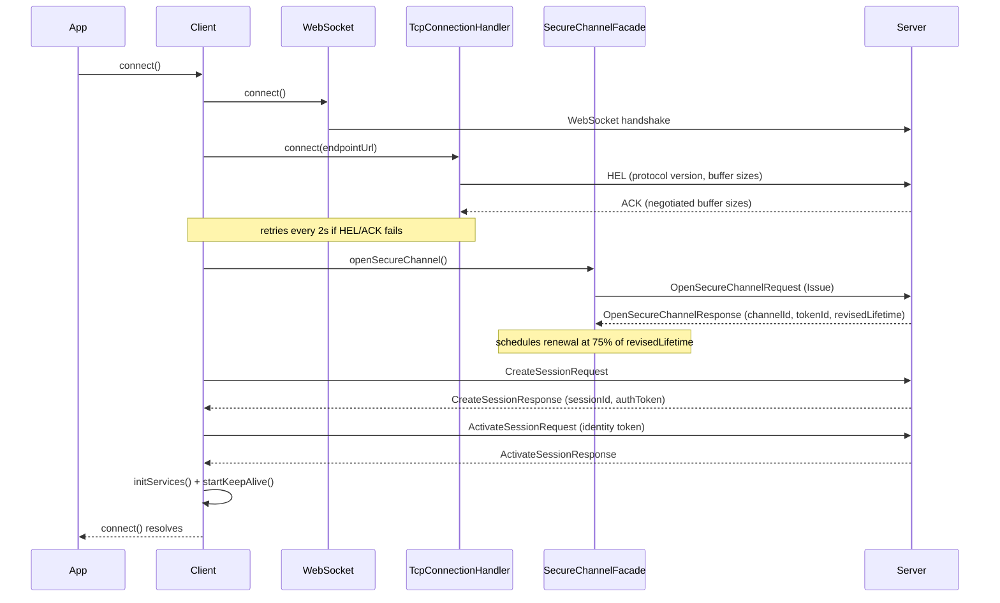
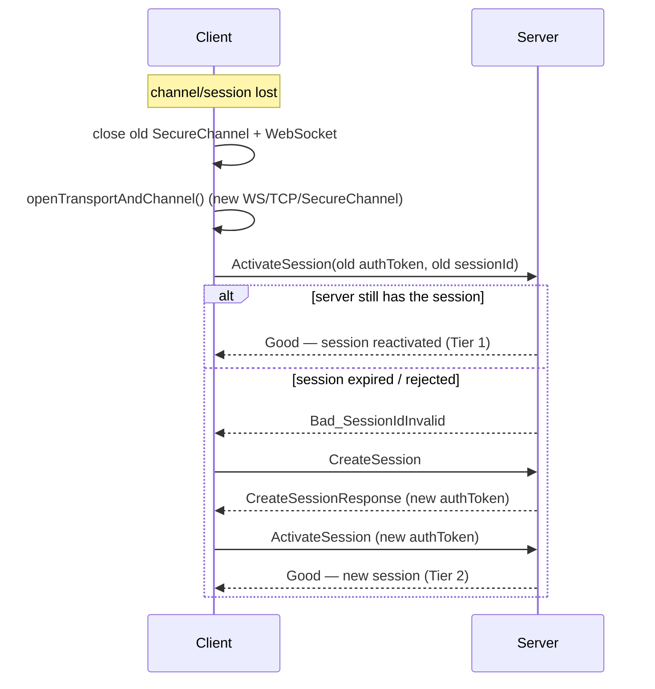

# Connection & Reconnection

This document explains how [`Client`](../../packages/client/src/client.ts) establishes a
connection to an OPC UA server and how it automatically recovers when the connection is lost.

## 1. The transport pipeline

A connection is really a chain of `TransformStream`s wired together once per connection attempt.
`Client.openTransportAndChannel()` (in
[client.ts](../../packages/client/src/client.ts)) builds it fresh every time — both for the
initial `connect()` and for every reconnect — which is what makes teardown/rebuild on reconnect
simple: nothing is reused, everything is recreated.

- **`TcpMessageDecoupler`/`TcpMessageInjector`** — parse/inject the raw UA-TCP frames (`HEL`,
  `ACK`, `ERR`) used only during the handshake.
- **`SecureChannelContext`** ([secureChannelContext.ts](../../packages/base/src/secureChannel/secureChannelContext.ts))
  is mutable shared state threaded through the whole pipeline: `channelId`, `tokenId`, and the
  request/sequence number counters. It's recreated for every new channel.
- **`SecureChannelFacade`** ([secureChannelFacade.ts](../../packages/base/src/secureChannel/secureChannelFacade.ts))
  sits on top of the pipeline and exposes the request/response API (`issueServiceRequest`) used by
  everything above it (session and application services).

## 2. Establishing a connection (`Client.connect()`)

Steps, with source references:

1. **WebSocket + UA-TCP handshake** — `openTransportAndChannel()` opens the `WebSocketFascade`,
   then loops calling `tcpConnectionHandler.connect(endpointUrl)` (sends `HEL`, waits for `ACK`),
   retrying every 2 seconds until it succeeds
   ([client.ts](../../packages/client/src/client.ts#L467)).
2. **OpenSecureChannel (Issue)** — `SecureChannelFacade.openSecureChannel()` sends the request and,
   on response, stores `channelId`/`tokenId` in the `SecureChannelContext` and schedules the first
   renewal ([secureChannelFacade.ts](../../packages/base/src/secureChannel/secureChannelFacade.ts#L143)).
3. **Security enforcement** — `enforceChannelSecurityConfig()` checks the negotiated policy/mode
   against the client's `SecurityConfiguration` and throws if it doesn't comply.
4. **CreateSession + ActivateSession** — `SessionHandler.createNewSession()`
   ([sessionHandler.ts](../../packages/client/src/sessions/sessionHandler.ts#L11)) calls
   `SessionService.createSession()`, retrying once with the configured
   `applicationInstanceCertificate` if the server throws `CertificateRequiredError` (OPC UA 1.0
   fallback), then calls `session.activateSession(identity)`.
5. **Service init + keep-alive** — `initServices()` (re)creates `AttributeService`,
   `MethodService`, `BrowseService`, `SubscriptionService` bound to the session's auth token, and
   `startKeepAlive()` starts the periodic keep-alive timer.

## 3. Reconnection

There is **no explicit connection state machine** — `Client` just holds optional fields
(`session`, `secureChannel`, `secureChannelFacade`, `ws`) that are `undefined` when disconnected,
plus two dedupe flags (`shutdownReconnectPending`, `publishLoopReconnectPending`) so overlapping
triggers don't start multiple reconnects at once.

All recovery paths funnel through one method:
[`reconnectAndReactivate()`](../../packages/client/src/client.ts#L531), which:

1. Closes the old `SecureChannelFacade` (cancels the pending renewal timer) and `WebSocket`,
   best-effort (they may already be dead).
2. Rebuilds the whole pipeline via `openTransportAndChannel()` (same code path as `connect()`).
3. **Tier 1 — reactivate the existing session**: calls
   `SessionHandler.tryActivateExistingSession()` with the old `authToken`/`sessionId`/`endpoint`,
   which just sends `ActivateSession` on the new channel. If the server accepts it, the same
   session (and its subscriptions) survive with no `CreateSession` at all.
4. **Tier 2 — fall back to a new session**: if reactivation throws/rejects,
   `SessionHandler.createNewSession()` runs the full `CreateSession` + `ActivateSession` sequence.

### 3.1 Triggers

| Trigger | Detected in | Behaviour |
|---|---|---|
| A service call throws `SessionInvalidError` (`Bad_SessionIdInvalid`/`Bad_SessionClosed`) | [`withSessionRefresh()`](../../packages/client/src/client.ts#L222) | Skips straight to Tier 2 (`createNewSession()`) — the channel is fine, only the session is gone — then retries the original call once. |
| A service call throws any other error (channel dropped, timeout, transport error) | [`withSessionRefresh()`](../../packages/client/src/client.ts#L222) | Calls `reconnectAndReactivate()` (Tier 1 → Tier 2), then retries the original call once. If reconnect itself fails, the *original* error is rethrown to the caller. |
| Keep-alive read reports `ServerStatus.state == Shutdown` | [`handleServerShutdownDetected()`](../../packages/client/src/client.ts#L303) | Reads `EstimatedReturnTime`, waits the computed delay, then calls `reconnectAndReactivate()`. |
| Subscription `StatusChangeNotification` reports `BadShutdown`/`BadServerHalted` | `SubscriptionHandler.onShutdown` → same handler as above | Same as above. |
| The publish loop stops because a `Publish` call failed | [`handlePublishLoopError()`](../../packages/client/src/client.ts#L345) | Calls `reconnectAndReactivate()`, then `restartPublishLoop()` so notifications resume. |

Every trigger is a "retry once" pattern: if `withSessionRefresh`'s retry fails again, or a
background reconnect (shutdown/publish-loop) fails, the error/log is surfaced but **no further
automatic attempts are scheduled** — the next application call (or the next keep-alive tick) is
what drives the next attempt. There is currently no exponential backoff or attempt limit (tracked
as an open item in the [auto-reconnect backlog doc](../backlog/core-2022-client-facet/session-client-auto-reconnect.md)).

### 3.2 Server shutdown delay calculation

[`computeReconnectDelayMs()`](../../packages/client/src/client.ts#L379) reads
`Server/ServerStatus/EstimatedReturnTime` (`ns=0;i=2992`) to decide how long to wait:

- Valid future `DateTime` → wait `estimatedReturnTime - now`.
- Past `DateTime` → reconnect after `configuration.minReconnectDelayMs` (default `1000` ms).
- OPC UA `MinDateTime` (server says it isn't restarting) → returns `null`; the client fires
  `onPermanentShutdown()` instead of reconnecting.
- Read fails / unavailable → falls back to `configuration.shutdownReconnectDelayMs` (default
  `5000` ms).

## 4. Keep-alive

[`startKeepAlive()`](../../packages/client/src/client.ts#L265) runs a `setInterval` every
`KEEP_ALIVE_INTERVAL_MS` (25 s — must stay below the server's `revisedSessionTimeout`, typically
60 s):

- If a subscription with active monitored items exists (`subscriptionHandler.hasActiveSubscription()`),
  the tick is a no-op — the `Publish` loop's traffic already keeps the session alive.
- Otherwise it reads `Server_ServerStatus` (`ns=0;i=2256`), which both resets the server's session
  timeout and lets the client observe `ServerStatus.state` to detect an announced shutdown.
- A keep-alive read failure is only logged — it does **not** by itself trigger a reconnect (the
  next service call, or the eventual publish/keep-alive failure pattern, will).

## 5. Key files

| File | Responsibility |
|---|---|
| [`packages/client/src/client.ts`](../../packages/client/src/client.ts) | Orchestrates connect/disconnect, keep-alive, shutdown detection, and all reconnection tiers. |
| [`packages/client/src/sessions/sessionHandler.ts`](../../packages/client/src/sessions/sessionHandler.ts) | `createNewSession()` / `tryActivateExistingSession()` / `closeSession()`. |
| [`packages/client/src/sessions/session.ts`](../../packages/client/src/sessions/session.ts) | Wraps an active session's id/authToken/endpoint and exposes `activateSession()`. |
| [`packages/client/src/sessions/sessionInvalidError.ts`](../../packages/client/src/sessions/sessionInvalidError.ts) | Thrown by service calls when the server reports the session is gone. |
| [`packages/client/src/services/sessionService.ts`](../../packages/client/src/services/sessionService.ts) | Raw `CreateSession`/`ActivateSession`/`CloseSession` requests. |
| [`packages/base/src/secureChannel/secureChannelFacade.ts`](../../packages/base/src/secureChannel/secureChannelFacade.ts) | `OpenSecureChannel` (Issue/Renew), owns the proactive renewal timer, `issueServiceRequest()`. |
| [`packages/base/src/secureChannel/secureChannelContext.ts`](../../packages/base/src/secureChannel/secureChannelContext.ts) | Shared mutable channel state: ids, sequence numbers. |
| [`packages/base/src/transports/ws/tcpConnectionHandler.ts`](../../packages/base/src/transports/ws/tcpConnectionHandler.ts) | UA-TCP `HEL`/`ACK` handshake. |
| [`packages/base/src/transports/ws/webSocketFascade.ts`](../../packages/base/src/transports/ws/webSocketFascade.ts) | Cross-platform (browser/Node) WebSocket wrapper. |
| [`packages/client/src/subscription/subscriptionHandler.ts`](../../packages/client/src/subscription/subscriptionHandler.ts) | Publish loop, shutdown-via-notification detection, `restartPublishLoop()`. |
| [`packages/client/src/configuration/configurationClient.ts`](../../packages/client/src/configuration/configurationClient.ts) | `shutdownReconnectDelayMs`, `minReconnectDelayMs`, and other tunables. |

## 6. Known gaps

- No exponential backoff or maximum-attempt/give-up policy for reconnects.
- Monitored items are only preserved across a channel/session-reactivation (Tier 1); a full
  Tier 2 session recreation currently relies on the application re-subscribing (see
  `SubscriptionHandler.updateServices()`), not the client re-issuing `CreateMonitoredItems`
  automatically.

See the [Session Client Auto Reconnect](../backlog/core-2022-client-facet/session-client-auto-reconnect.md)
backlog doc for the authoritative list of open items and spec references.
